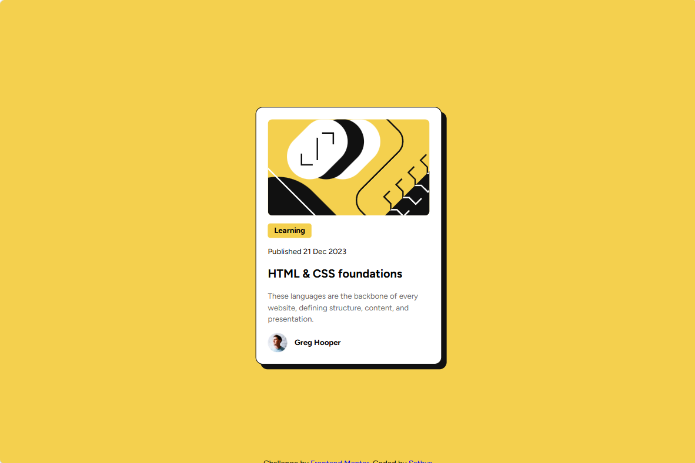

# Frontend Mentor - Blog Preview Card Solution

This is my solution to the [Blog Preview Card Challenge](https://www.frontendmentor.io/challenges/blog-preview-card-ckPaj01IcS) on Frontend Mentor. This project helped me strengthen my understanding of responsive layouts, hover effects, and clean component design using HTML and CSS.

---

## Overview

### The Challenge

Users should be able to:

- View hover and focus states for all interactive elements.
- Experience a clean, responsive card layout across different screen sizes.

### Screenshot

### Links

- **Solution URL:** https://sathyakatrapalli2007.github.io/blog-card-preview/
- **Live Site URL:** https://sathyakatrapalli2007.github.io/blog-card-preview/

---

## My Process

### Built With

- Semantic HTML5
- CSS3
- Flexbox
- Mobile-first workflow
- Google Fonts (Figtree)

---

### What I Learned

Working on this project reinforced several important CSS concepts.

- Building reusable card components.
- Applying shadows and border styling for visual depth.
- Using Flexbox for layout and alignment.
- Writing cleaner, more organized CSS.

---

### Continued Development

For future projects, I plan to focus on:

- Writing more scalable and maintainable CSS.
- Exploring CSS Grid for more complex layouts.
- Improving accessibility with semantic HTML and keyboard navigation.
- Building responsive multi-component interfaces before moving to JavaScript frameworks.

---

### AI Collaboration

I used Gemini as a learning and debugging assistant throughout this project.

- **Tool Used:** Gemini
- **How I Used It:**
  - Debugged CSS layout issues.
  - Improved Flexbox alignment.
  - Refined hover effects and spacing.
  - Reviewed HTML structure and best practices.
- **What Worked Well:**
  - Helped identify layout problems quickly.
  - Explained concepts clearly instead of only providing code.
- **What I Learned:**
  - AI is most effective as a learning partner for understanding concepts and debugging, while I implemented and tested the final solution myself.

---

## Author

- **GitHub:** https://github.com/sathyakatrapalli2007

---

## Acknowledgments

Thanks to Frontend Mentor for providing practical frontend challenges that help developers improve through hands-on projects.